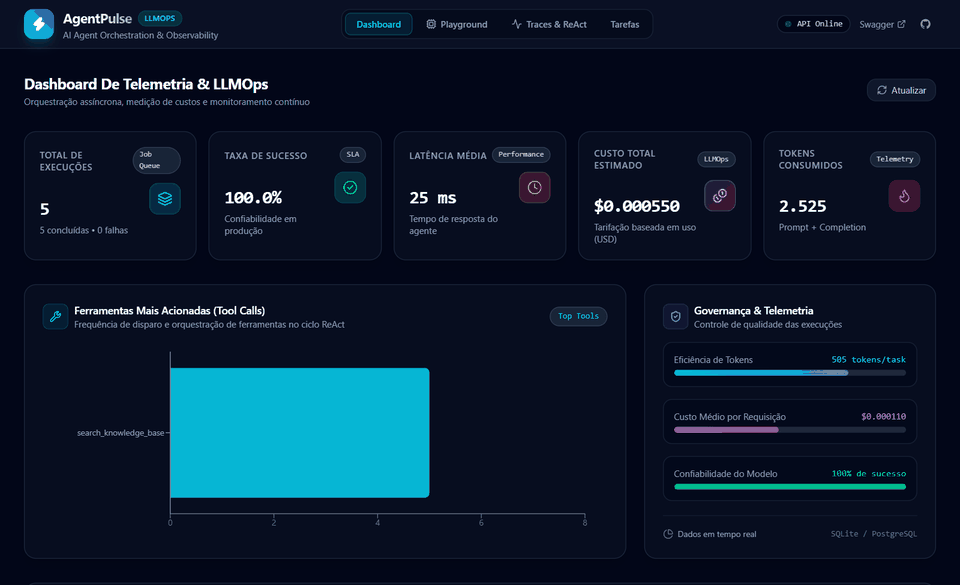

# ⚡ AgentPulse Web — AI Agent Observability & Telemetry Dashboard

<p align="center">
  
  
  
  
  
</p>

Interface web moderna inspirada em plataformas como **Langfuse** e **Datadog** para orquestração e observabilidade de **Agentes Autônomos de IA (LLMOps)**.

O frontend se comunica em tempo real com a **[AgentPulse API (FastAPI)](https://github.com/IkkiMachado/agentpulse-api)**, exibindo métricas financeiras, contagem de tokens, latência e a árvore hierárquica de raciocínio passo a passo (*ReAct Traces*).

---

## 🎬 Demonstração Visual em Ação

<!-- Coloque sua gravação em agentpulse-web/docs/agentpulse-demo.gif -->
<p align="center">
  
</p>

> **Destaques da Demonstração (30 a 45s):**
> 1. **Execução Assíncrona:** Disparo no Playground com resposta imediata HTTP `202 Accepted` e polling progressivo com spinner de status.
> 2. **Ciclo ReAct Auditável:** Transição com 1 clique para o *TraceViewer* inspecionando a árvore `THOUGHT` ➔ `TOOL_CALL` ➔ `TOOL_RESULT` ➔ `FINAL_ANSWER`.
> 3. **Telemetria de Custos em Tempo Real:** Medição precisa de tokens consumidos e tarifação em USD baseada no modelo selecionado (*Gemini 2.5 Flash*).
> 4. **Dashboard de Governança:** Visão unificada de SLA (taxa de sucesso), latência média e distribuição de ferramentas mais acionadas (*Recharts*).

---

## ✨ Funcionalidades Principais

1. 📊 **Dashboard Analítico de LLMOps:**
   * Cards de KPIs em tempo real (Total de Tarefas, Taxa de Sucesso %, Latência Média, Custo Acumulado em USD e Tokens).
   * Gráficos analíticos com distribuição de ferramentas mais acionadas (*Tool Calls*) e tempo médio de execução.
   * Indicadores de governança e custo médio por requisição.

2. 🚀 **Playground Interativo de Execução:**
   * Seleção dinâmica de agentes de IA com modelo e prompt mestre.
   * Sugestões rápidas de prompts para testes.
   * Disparo assíncrono (*Asynchronous Request-Reply*) com stepper visual de status e polling automático.
   * Exibição imediata da síntese final, contagem de tokens e custo em dólares.

3. 🔍 **Visualizador de Traces (Observabilidade ReAct):**
   * Inspeção passo a passo da árvore de raciocínio do modelo:
     * `THOUGHT`: Raciocínio interno antes de cada ação.
     * `TOOL_CALL`: Nome da ferramenta e argumentos em JSON.
     * `TOOL_RESULT`: Retorno bruto da ferramenta e latência.
     * `FINAL_ANSWER`: Resposta final entregue ao cliente.
   * Painel lateral de metadados da execução.

4. 📋 **Histórico de Tarefas & Auditoria:**
   * Tabela com todas as execuções, status (`COMPLETED`, `FAILED`, `PENDING`), duração em ms e atalho direto para visualizar os traces de qualquer tarefa.

---

## 🛠️ Stack Tecnológica

* **Framework:** React 19 + TypeScript
* **Build Tool:** Vite 8
* **Estilização:** Tailwind CSS v4
* **Ícones:** Lucide React
* **Gráficos:** Recharts
* **Comunicação:** Fetch API com proxy reverso no Vite (`/api` ➔ `http://localhost:8000`)

---

## 🚀 Como Executar Localmente

### 1. Entrar na pasta do projeto
```bash
cd agentpulse-web
```

### 2. Instalar dependências
```bash
npm install
```

### 3. Iniciar o servidor de desenvolvimento
```bash
npm run dev
```

Abra no navegador em: **[http://localhost:5173](http://localhost:5173)**.

> **Nota:** Certifique-se de que o backend **AgentPulse API** esteja em execução na porta `8000` para carregar as métricas e executar os agentes.
